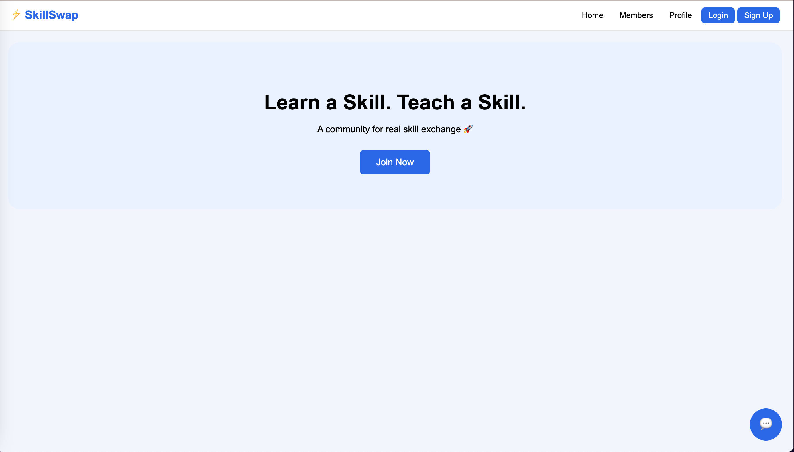
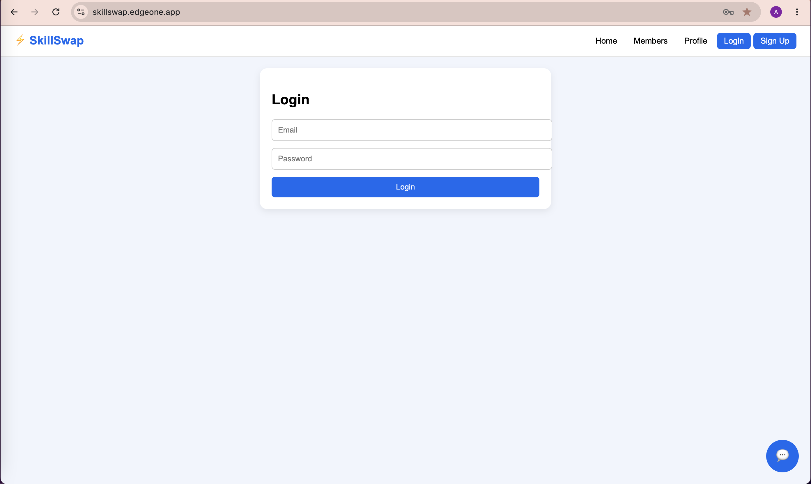
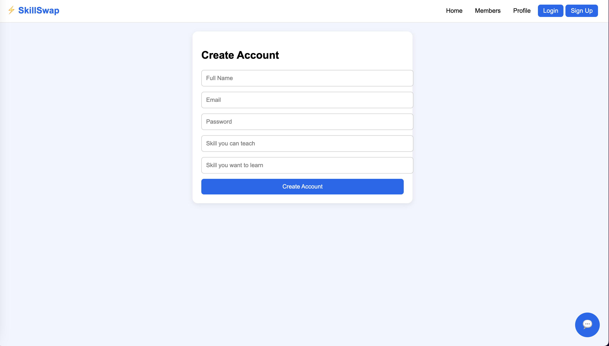
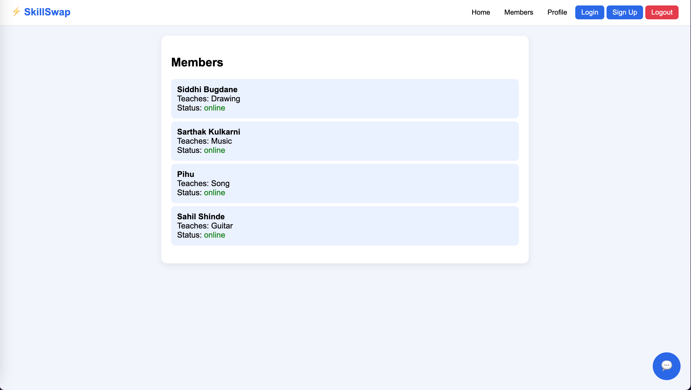
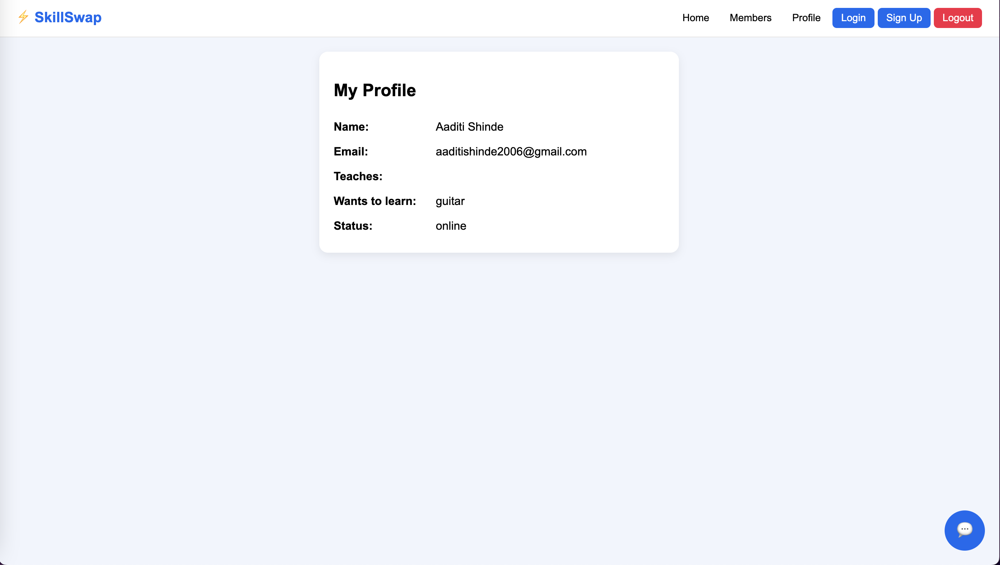
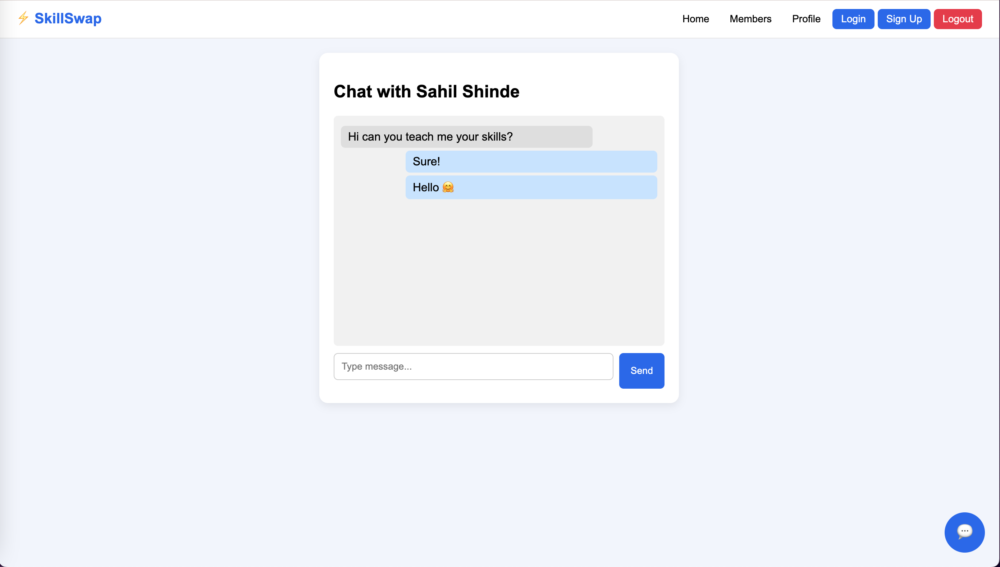

# 🚀 SkillSwap – Barter System

SkillSwap is an Android-based skill exchange platform where users can connect, share, and barter their skills without monetary transactions.

The platform allows users to create profiles, discover members, exchange knowledge, and communicate through real-time chat. A responsive web version was developed and packaged as an Android application (APK) for mobile users.

---
# 🌐 Live Demo

### 🌍 Web Application

https://skillswap.edgeone.app/

### 📱 Android APK

Download the latest APK here:

**Google Drive:**  
https://drive.google.com/file/d/19I7Apvv_7xrhAfsP4JP3NNWx3UMl1MTA/view?usp=drive_link

---
# 📌 Project Overview

SkillSwap connects people who want to learn new skills with those who are willing to teach them.

### Example

- Alice teaches Graphic Design.
- Bob teaches Web Development.

Alice can learn Web Development from Bob while teaching Graphic Design in return.

This creates a collaborative learning community based on skill exchange instead of money.

---

# ✨ Features

- 🔐 Firebase Authentication
- 👤 User Registration & Login
- 👤 User Profile Management
- 🤝 Skill Barter System
- 🔍 Browse Community Members
- 💬 Real-time Chat
- 📱 Android Mobile Application (APK)
- 🌐 Responsive Web Interface
- 🔥 Firebase Backend Integration

---

# 🛠️ Technologies Used

- HTML5
- CSS3
- JavaScript
- Firebase Authentication
- Firebase Firestore
- Android (APK)
- Git & GitHub

---

# 📂 Project Structure

```
SkillSwap-Barter-System
│
├── assets
│   ├── home-page.png
│   ├── login-page.png
│   ├── register-page.png
│   ├── member-page.png
│   ├── profile-page.png
│   └── chat-page.png
│
├── index.html
├── styles.css
├── app.js
├── .gitignore
└── README.md
```

---

# 📷 Project Screenshots

## 🏠 Home Page



---

## 🔐 Login Page



---

## 📝 Registration Page



---

## 👥 Members Page



---

## 👤 Profile Page



---

## 💬 Chat Page



---

# 🚀 Getting Started

1. Clone the repository

```bash
git clone https://github.com/your-username/SkillSwap-Barter-System.git
```

2. Open the project folder.

3. Launch `index.html` in your browser.

---

# 🎯 Future Enhancements

- 📹 Video Calling
- 🔔 Push Notifications
- ⭐ Rating & Review System
- 📅 Session Scheduling
- 🤖 AI-based Skill Recommendations

---

# 📚 Learning Outcomes

Through this project, I learned:

- Frontend Web Development
- Firebase Authentication
- Firebase Firestore Integration
- Real-time Chat Implementation
- Responsive UI Design
- Android APK Deployment
- Git & GitHub Version Control

---

# 👨‍💻 Developer

**Aaditi Shinde**

B.Tech – Instrumentation & Control Engineering

---

## ⭐ Support

If you found this project helpful, consider giving it a ⭐ on GitHub.
